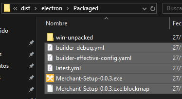

# House Bring


This version of House Bring is centered around being a desktop aplication. Already compiled for windows machines.

# Installation
```
$ git clone https://github.com/hbpt88/elect-update.git
$ cd elect-update
$ npm install
```


# Commands

```npm run dev``` Runs the app in development mode with electron support

```npm run build``` Generates an executable and update files. See 
[Updating](#updating) for more info


# Updating

**Steps to generate a new version:**

* Update app ``version`` in `package.json`
* Make a new release in the [update repository](https://github.com/hbpt88/elect)

> [!TIP]    
> To change the repository that the app fetches from change `repository` on `package.json`

Upload files from `dist\electron\Packaged` in the release. 

> [!NOTE]   
> All files must be upload except for the `win-unpacked` folder    
> Remember to change all the spaces in the files with a Hyphen " - "


